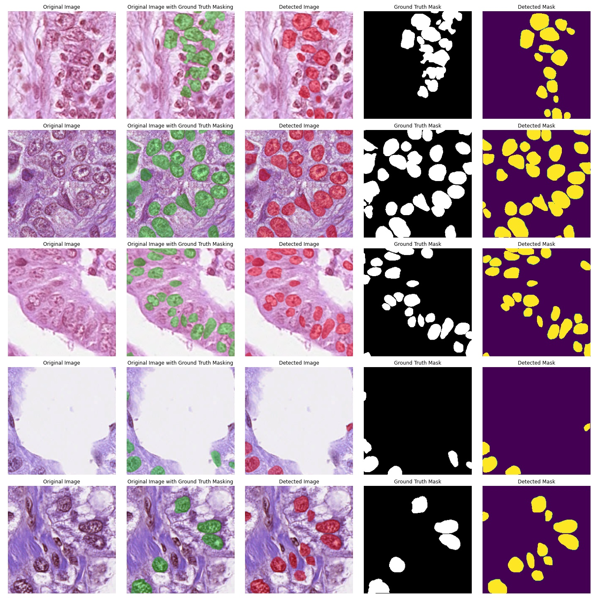

# Neoplastic-Cell-Nuclei-Segmentation-using-Mask-R-CNN
This project uses a state-of-the-art object detection and segmentation model called as the Mask R-CNN to detect and segment neoplastic cell nuclei from whole-slide images which are present in the PanNuke dataset. The motivation behind this was to build a system which could automate the process of cell segmentation thus saving researchers and pathologists some valuable time which is otherwise lost in this tedious process. The time saved can be used to further cancer research.

<b>Research Paper Available <a href='http://www.irphouse.com/ijert21/ijertv14n3_02.pdf'>Here</a>. Kindly cite if useful.</b>

## Package Requirements
- OpenCV version 4+
- imutils
- numpy
- imgaug
- tensorflow 2
- matplotlib

## How to use
Make sure all the packages listed below are installed properly
### data_extraction notebook
- Download all the folds of the dataset from <a href='https://warwick.ac.uk/fac/cross_fac/tia/data/pannuke'>here</a>
- Extract into prefered paths and relevantly update the paths in the 2nd cell of the notebook. Remember each fold has three paths- Images, Masks, Types
- Also remember to rewrite output directory properly and create corresponding folders to save data.
- Run till cell 4 and all data will be extracted into 2 folders as specified by the output paths. Each image will also specify the type of tissue patch for convenience.
- Ignore cells 5 to 11 for now as they will be used post training to create a testing split of types of tissues which in turn will be used later for metrics calculation.

### Model_Build_Train notebook
- Tune hyperparameters in the 2nd cell. Initial epoch= epoch to start training from (match it to the epoch number on the model checkpoint). Model weights if specified as  'new' then new training starts else if specified as 'old' then resumes training from initial epoch.
- 3rd cell is a linear lr decay function. Tune the 'final_epochs' and 'epoch' variable according to when training starts and when it end. Also remember to change the learning rate value json file path accordingly.
- Set the paths for output logs, pre-trained weights and input files in the 4th cell. Download COCO pretrained weights from <a href='https://drive.google.com/file/d/1PvehH8InLmWUOiRTSVFxpbe6ejs4vtWp/view?usp=sharing'>here.</a>
- Choose ratio of data split in 5th cell. If you decide to change the exp_split ratio (this is used to gather a subset of the data for training pipeline experimentation) then make appropriate changes in cell 8 as while choosing all the data I have manually kept 500 images aside for testing. So change that according to how much experimentation data you are using. Also change the random seed for reproducibility.
- Uncomment cell 9 (if commented out) to generate testing data and write it to file.
- Further tune hyperparameters in cell 10 and 11
- Run cell 13 to check if all the data loading functions are working properly. You must properly see the image and it's corresponding instance wise mask
- Tune augmentation parameters in cell 15 if needed. Leaving it to default values is also a good choice.
- In cell 16 I am using a custom callback training monitoring function which will create a plot of training per epoch, json files for all training values and json files for only training and validation loss (becomes easy to compare). Set the path properly for the figure and values in cell 16 and also open the sidekick/trainmonitor.py file and set the path for the loss values at line 58. Alternatively delete anything that you feel is not required.
- I am using a transfer learning process so training the model in 2 stages of heads and full model. Change the learning rate paths properly in cell 17 and 18 and alternatively change any methods of training like using 4e+ resnet to train before full model training. I trained 20 epochs on only heads and then 40 epochs with the entire model.
- My trained model can be found <a href='https://drive.google.com/file/d/1PvehH8InLmWUOiRTSVFxpbe6ejs4vtWp/view?usp=sharing'>here.</a>

### Inference_Results notebook
- Change trained model path and testing image path file in the 3rd cell
- Modify paths accordingly in the 4th cell
- Change the Steps for testing accordingly in the 5th cell. This number should be the amount of testing data you have.
- In cell 9 change the 'number_to_display' variable to determine how many cells to detect and display. The the cell multiple times and it will randomly display the images.
- You may face some problem with the 'get_corr_mask_path' variable. Edit the code to set the path properly. There can be changes depending on which OS you are working with and where the files have been saved.

### Inference_Metrics notebook
- Before running this notebook you will have to generate another file that stores the class types for Panoptic Quality measure. Go to the data_extraction notebook and run the last 4 cells. A new file with the tissue types will be generated
- Edit the num of images variable to calculate maP and PQ of a set of testing data.
- Also edit the path variables accordingly to the saved dataset.

## Results
Below are screenshots of my model's segmentation results. 

